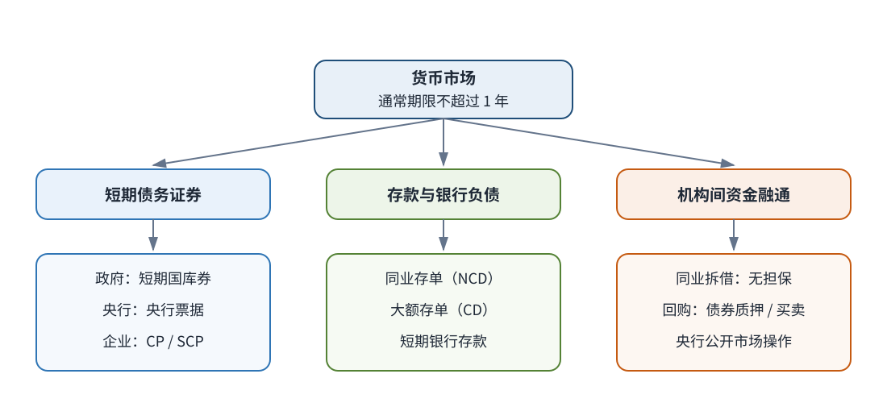
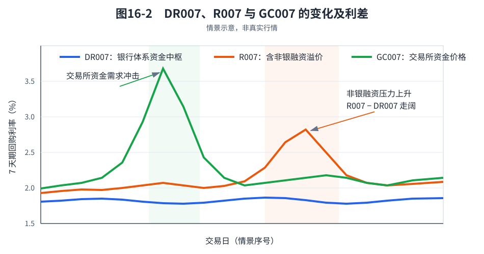

# 第16章　货币市场工具与回购市场

[](https://colab.research.google.com/github/albertandking/fixed-income/blob/main/notebooks/ch16_money_market_repo.ipynb) [](https://mybinder.org/v2/gh/albertandking/fixed-income/main?labpath=notebooks/ch16_money_market_repo.ipynb)

!!! info "配套代码"
    本章回购现金流、资金成本与杠杆套息均由复用包 `fi.repo` 实现；案例使用内置货币市场利率样本（`fi.data.load_sample("money_market")`），离线即可运行。

## 16.1 本章导读与学习目标

**前几章把债券视为孤立的现金流加以定价；而在真实市场中，债券投资者很少孤立地持有债券。** 机构通常以回购将持有的债券质押融资，再买入更多债券；以**存款类机构间 7 天期利率债质押式回购加权利率（DR007）**判断“资金面”松紧；并借助“持有收益高于融资成本”的利差，用杠杆将其放大为可观的回报。这套围绕**货币市场**与**回购**运转的机制，是中国债券市场流动性的核心，也是 2013 年“钱荒”、2016 年债灾的重要诱因。本章不推导复杂模型，而是说明**制度如何运转、现金流如何计算、杠杆如何放大收益与风险**。

!!! abstract "学习目标"
    学完本章，你应能：

    1. 按发行人和融资方式列举中国货币市场的主要工具，并区分国库券、同业存单、大额存单、短融/超短融、同业拆借与回购；
    2. 解释 **Shibor** 的形成方式，辨析同业拆借、Shibor 与 NCD 的关系；
    3. 计算贴现式货币市场工具的持有期收益率与简单年化收益率，并辨析贴现率与投资收益率；
    4. 描述银行间与交易所回购市场的主要交易方式，比较**质押式回购**与**买断式回购**；
    5. 解读中国回购利率体系（**DR / R / GC**），说明 DR007、R007−DR007 与 GC007 分别反映什么；
    6. 推导**杠杆套息**的权益回报恒等式 $\text{ROE}=y+(L-1)(y-r)$，并说明 carry、roll-down 与杠杆的关系；
    7. 用 `fi.repo` 测算回购资金成本与杠杆收益，辨析利率风险、滚动续作风险与负 carry 风险。

---

!!! note "本章知识结构"
    **货币市场工具**（16.2，短期债务证券 / 存款与银行负债 / 同业拆借及其基准利率）
    　→ **报价与收益率**（16.3，贴现率 / 持有期收益率 / 简单年化收益率）
    　→ **回购机制**（16.4，正逆回购 / 质押式与买断式 / 担保品折扣）
    　→ **两类市场与三套利率**（16.5，银行间 / 交易所；DR / R / GC）
    　→ **杠杆套息**（16.6，借短买长、$\text{ROE}=y+(L-1)(y-r)$、三类风险）
    　→ **套息策略复盘**（16.8）

## 16.2 货币市场工具概览

**货币市场**是融通短期资金、管理流动性的市场，通常涵盖期限在 **1 年以内**的金融工具和交易。政府、金融机构和企业可以在这里筹集短期资金，持有暂时闲置资金的机构也可以进行短期配置。

货币市场工具虽然期限较短，但风险来源并不相同。例如，短期国库券以国家信用为基础，通常被视为短端低信用风险资产；企业发行的短期融资券则取决于企业自身的偿债能力。资金融通方式也会影响风险：同业拆借主要依靠交易对手信用，不要求提供担保品；回购交易以债券提供担保，能够降低信用暴露，但仍存在交易对手违约、担保品价格波动和流动性等风险。因此，认识一种货币市场工具时，应同时考察**融资主体、期限、是否有担保以及交易场所**。

<figure markdown>
  
  <figcaption>图16-1　中国货币市场工具分类</figcaption>
</figure>

### 16.2.1 短期债务证券

第一类工具是政府、中央银行和非金融企业发行的短期债务证券。投资者买入证券，相当于在约定期限内向发行人提供资金；到期能否获得偿付，主要取决于发行人的信用基础。

| 中文名称 | 英文名称与常用缩写 | 发行人 / 债务人 | 常见期限 | 主要市场 | 经济含义与典型用途 |
|---|---|---|---|---|---|
| **短期国库券** | Treasury Bill（T-bill） | 财政部 | 3 个月、6 个月、1 年等 | 银行间、交易所 | 政府为短期财政需要融资，通常采用贴现发行；投资者以低于面值的价格买入，到期按面值收回本金 |
| **央行票据** | Central Bank Bill | 中国人民银行 | 以具体发行条款为准 | 银行间 | 央行发行的负债工具，可用于回笼流动性；期限超过 1 年的央票不因名称中有“票据”就自动归入货币市场 |
| **短期融资券** | Commercial Paper（CP） | 非金融企业 | 1 年以内 | 银行间 | 企业为补充营运资金等短期用途发行的信用债，偿付能力取决于发行企业 |
| **超短期融资券** | Super &amp; Short-term Commercial Paper（SCP） | 非金融企业 | 270 天以内 | 银行间 | 期限短于一般 CP，便于企业灵活、滚动安排短期融资，但投资者仍承担企业信用风险 |

短期国库券以国家信用为基础，可为其他货币市场工具提供低信用风险的短端收益率参照。CP 和 SCP 则属于企业信用工具，其收益率除受期限和市场流动性影响外，还会反映市场对发行企业偿债能力的判断。

### 16.2.2 存款与银行主动负债工具

第二类工具形成银行对资金提供者的负债，主要包括大额存单和同业存单。两者都由银行吸收资金，但面向的投资者、交易场所和流动性安排不同。

**大额存单（Large-denomination Certificate of Deposit，CD）**是银行面向个人、非金融企业、机关团体等发行的记账式大额存款凭证，属于银行存款产品；**同业存单（Negotiable Certificate of Deposit，NCD）**则由存款类金融机构在银行间市场发行，主要由金融机构和资管产品投资，是标准化、可交易的短期债务工具。

| 对比维度 | 大额存单（CD） | 同业存单（NCD） |
|---|---|---|
| 典型购买者 | 个人、非金融企业等存款客户 | 银行、基金、券商资管等银行间投资者 |
| 所在市场 | 银行存款业务体系 | 银行间市场 |
| 经济实质 | 金额较大的定期存款凭证 | 银行发行的标准化、可交易短期债务工具 |
| 主要用途 | 存款客户配置确定期限的存款 | 银行主动负债，投资者配置短端信用资产 |
| 主要价格指标 | 产品利率 | 发行利率、二级市场收益率及到期曲线 |

!!! note "为什么 NCD 利率是观察银行负债压力的窗口"
    当银行希望快速补充市场化资金时，可以提高 NCD 发行利率吸引投资者。因此，NCD 利率上行常提示银行中短期负债成本上升。不过，NCD 是一张有期限、可交易的债务工具，其利率还包含发行银行信用、期限和供求因素，不能与隔夜资金价格画等号。

!!! example "例16.1：相同期限工具的收益率差异"
    假设同一天出现三种 180 天工具：财政部短期国库券收益率 1.50%，某大型银行 NCD 发行利率 1.75%，某制造企业 CP 发行利率 2.10%。三者期限接近，后两者相对国库券多出的 0.25% 和 0.60%，可粗略理解为市场对**信用风险、流动性和供求**要求的补偿。这里的数字仅用于教学，不代表实际报价。

### 16.2.3 金融机构间短期资金融通

第三类不是由某个发行人预先创设证券，而是金融机构之间直接融通资金。其中，**同业拆借**依靠机构信用进行无担保融资；**回购交易**则通过债券质押或两次方向相反的债券买卖实现短期融资。

#### 同业拆借及其报价基准 Shibor

**同业拆借**是经批准进入市场的金融机构之间，为调剂短期资金余缺而进行的无担保资金融通。借入方不提供抵押券，融出方主要依据交易对手的信用状况决定是否成交以及资金价格。它是一种实际交易行为：双方约定金额、期限和利率，到期完成本息偿付。

**Shibor（上海银行间同业拆放利率）**不是融资工具，也不代表某一笔实际成交，而是由信用等级较高的报价银行报出人民币同业拆出利率后计算形成的基准利率。其利率属性为**单利、无担保、批发性利率**，公布隔夜、1 周、2 周、1 个月、3 个月、6 个月、9 个月和 1 年等期限。

二者的关系可以概括为：**同业拆借是资金交易，Shibor 是与无担保同业资金相对应的报价基准。** 实际拆借利率可以参考 Shibor，但不必与之完全相同；Shibor 也不是所有实际成交利率的简单平均。

#### 回购：以债券安排实现的短期融资

质押式回购中，资金融入方以债券设立质押；买断式回购则通过首期卖出债券、到期再买回同种债券实现融资。相较于无担保的同业拆借，债券质押或所有权转移为资金融出方提供了额外保障，但交易仍需管理标的债券价格、市场流动性和交易对手违约风险。两类回购的具体法律结构、交易方式和利率指标将在 16.4—16.5 中展开。

| 易混概念 | 信用保障方式 | 性质 | 融资主体 | 主要用途 |
|---|---|---|---|---|
| **Shibor** | 无担保报价口径 | 基准利率，不是融资工具 | 不适用；由报价银行提供报价 | 定价参考、浮息产品和衍生品基准 |
| **同业拆借** | 无担保，依赖交易对手信用 | 资金交易 | 金融机构向金融机构借款 | 临时调剂头寸 |
| **NCD** | 依赖发行银行信用，不逐笔设置担保 | 可持有、可交易的债务工具 | 银行向银行间投资者发行债务 | 银行主动负债 |
| **回购** | 质押式设立债券质押；买断式转移债券所有权 | 资金交易或具有融资效果的债券买卖安排 | 持券机构融入资金 | 日常融资、流动性管理和杠杆 |

!!! example "例16.2：银行 7 天期资金需求的融资选择"
    某银行临时需要 10 亿元资金：若凭自身信用直接向另一家机构借入，属于**同业拆借**，交易利率可以参考相应期限的 Shibor；若以国债提供担保融入资金，属于**质押式回购**，应观察 DR 或 R；若提前发行一张 3 个月同业存单，则是通过 **NCD** 进行主动负债。三种方式都能满足资金需求，但在期限、担保安排、交易成本和价格基准等方面存在差异。

---

## 16.3 货币市场工具的报价与收益率

认识货币市场工具之后，还需要把不同报价转换到可比较的收益率口径。短期国库券、贴现式 NCD 等工具通常以低于面值的价格发行，到期按面值兑付；另一些 NCD、存款和回购则直接给出年化利率。若不区分分母和年化天数，不同报价不能直接比较。

### 16.3.1 贴现价格与持有期收益率

设贴现工具的面值为 $F$，买入价格为 $P$，距到期日还有 $d$ 天。持有至到期获得的金额收益为 $F-P$，相对于实际投入资金的**持有期收益率**为

$$
HPR=\frac{F-P}{P}.
$$

若采用 ACT/365 的简单年化口径，则

$$
y_{\text{simple}}=\frac{F-P}{P}\times\frac{365}{d}.
$$

这里以买入价格 $P$ 为分母，回答的是“实际投入一元资金，在持有期内赚取多少收益”。

### 16.3.2 贴现率与投资收益率的区别

有些市场报价使用面值作为分母，并按 360 天年化，得到**银行贴现率**：

$$
d_{\text{bank}}=\frac{F-P}{F}\times\frac{360}{d}.
$$

贴现率以面值 $F$ 为分母，简单年化收益率以实际投资额 $P$ 为分母，二者通常不相等。比较不同工具时，应先统一分母和年化天数；具体交易仍须以发行文件或市场规则规定的计息口径为准。

!!! example "例16.3：贴现式国库券的收益率"
    某 180 天期贴现式国库券面值为 100 万元，买入价格为 99 万元，到期按面值兑付。

    持有期收益率为

    $$HPR=\frac{1{,}000{,}000-990{,}000}{990{,}000}=1.0101\%.$$

    按 ACT/365 简单年化的投资收益率为

    $$y_{\text{simple}}=1.0101\%\times\frac{365}{180}=2.0487\%.$$

    若按 360 天银行贴现率报价，则

    $$d_{\text{bank}}=\frac{10{,}000}{1{,}000{,}000}\times\frac{360}{180}=2.0000\%.$$

    同一工具由此得到 2.0487% 和 2.0000% 两个数字，差异来自**分母和年化天数不同**，并不表示存在两个经济收益。

!!! note "附息式短期工具"
    对直接给出年利率 $r$ 的短期工具，若采用 ACT/365 单利，持有 $d$ 天的利息为 $I=P\times r\times d/365$。同业存单既可能采用贴现方式，也可能采用附息方式，应以具体发行条款为准。

---

## 16.4 回购市场机制：质押式 vs 买断式

从经济效果看，**回购（repo）是一笔以债券提供信用保障的短期融资**。融入资金的一方称为**正回购方**，融出资金的一方称为**逆回购方**。需要留意，质押式与买断式的法律结构不同：前者设立质押，后者以“先卖出、再买回”实现融资，不能都简单表述为“把债券抵押出去”。

理解质押式回购，可先把它类比为**当铺**：持券机构暂时缺钱，但不想卖出债券，于是以债券提供担保，取得一笔略低于担保品价值的资金，并在数日后偿还本金和利息。这个类比只帮助理解经济效果；真实回购还涉及标准合同、托管结算、担保品折算率和违约处置规则，不能等同于普通民间质押。

### 16.4.1 两种回购的本质区别

| 维度 | 质押式回购（Pledged Repo） | 买断式回购（Outright Repo） |
|---|---|---|
| 法律结构 | 以债券设立质押，所有权**不转移** | 首次结算卖出债券、到期结算买回，所有权发生**转移** |
| 逆回购方能否再处置 | 否（券被冻结） | 能（可再卖出/再质押） |
| 主要用途 | 日常头寸管理、融资与杠杆 | 提高券的可使用性，也可服务融券、做空等策略 |
| 操作与核算 | 流程标准化，持仓关系较直观 | 需处理所有权转移、首期/到期两次结算及相应核算 |
| 主要风险 | 交易对手违约、担保品价格与流动性风险 | 除交易对手风险外，还要管理标的券返售与再处置风险 |

#### 为什么国内质押式回购是主流

质押式回购的优势不是“绝对安全”，而是**简单、标准化、风险边界相对清楚**：债券所有权不转移，担保品在存续期内受控；交易双方只需围绕资金额、期限、利率和担保品价值管理风险；对日常隔夜、7 天资金周转尤其高效。

买断式回购使逆回购方真正取得债券，因而可以再卖出或再融资，券的使用效率更高。但所有权转移也带来更复杂的会计核算、税务判断、券息归属、履约返售和内部风控问题。国内机构日常需求多是“以券换钱”，未必需要处置标的券，因此买断式回购的使用规模相对较小。**“质押式是主流”是效率与制度成本共同作用的结果，而不是买断式在理论上更差。**

### 16.4.2 正回购、逆回购与央行公开市场操作

“正回购”和“逆回购”必须结合观察主体理解。对普通市场机构而言，**正回购方融入资金、提供债券安排**，逆回购方融出资金、取得债券质押权或债券。新闻中的“央行逆回购”则从央行视角命名：央行买入证券并约定未来返售，向银行体系投放资金。

| 观察主体与操作 | 当期资金方向 | 对银行体系流动性的影响 |
|---|---|---|
| 市场机构进行正回购 | 机构融入资金 | 取决于交易对手，不直接改变银行体系资金总量 |
| 市场机构进行逆回购 | 机构融出资金 | 取决于交易对手，不直接改变银行体系资金总量 |
| 央行开展逆回购 | 央行向市场投放资金 | 增加银行体系流动性 |
| 央行开展正回购 | 央行从市场回笼资金 | 减少银行体系流动性 |

!!! tip "判断方向的简便方法"
    不要只记“正”或“逆”，而应先问：**谁是观察主体，谁在当期收到现金？** 对市场机构而言，正回购方当期收到现金；对央行而言，逆回购操作向市场支付现金。

### 16.4.3 回购现金流与利息

中国银行间回购利息按**实际天数 / 365 单利**计算：

$$I=\text{本金}\times r\times\frac{\text{天数}}{365}$$

从**融资方（正回购）**视角的现金流：

- 第 0 天：交付质押券，**收到资金**（本金 $C$）；
- 第 $N$ 天：**偿还** $C+I$，赎回质押券。

逆回购方现金流方向相反：第 0 天融出 $C$，到期收回 $C+I$。

!!! example "例16.4：7 天质押式回购的现金流"
    某基金以面值 1 亿元的国债质押，做 7 天质押式回购融资，回购利率 1.85%。

    **利息**：

    $$I=100{,}000{,}000\times1.85\%\times\frac{7}{365}=35{,}479.45\text{ 元}$$

    **现金流**：第 0 天收到 1 亿元；第 7 天偿还 $100{,}035{,}479.45$ 元，赎回质押的国债。

    若融资方把这 1 亿元又买入国债、再质押、再融资……就形成了**杠杆**（见 16.6）。

### 16.4.4 折扣率、质押率与标准券折算率

资金融出方不会只关心债券的面值，还会关注担保品当前市值以及违约后能否及时处置。在简化的一对一质押融资中，可用**质押率**或**折扣率（haircut）**描述担保品价值与融资额之间的关系：

$$
\text{可融资金额}=\text{担保品市值}\times\text{质押率}
=\text{担保品市值}\times(1-\text{haircut}).
$$

例如，债券市值为 1 亿元、质押率为 95%，则可融资金额为 9500 万元，对应 haircut 为 5%。haircut 越高，说明资金融出方为价格波动、流动性和信用风险保留的安全垫越大。

交易所通用质押式回购使用的**标准券折算率**也用于确定融资额度，但它是由业务规则和担保品管理制度规定的换算参数，将不同合格债券折算为统一的标准券数量。它与双边交易中约定的 haircut 经济功能相近，但制度来源、计算方法和适用场景不同，不能不加区分地互换使用。

!!! warning "最大杠杆公式的适用条件"
    后文使用 $L_{\max}=1/\text{haircut}$ 时，假设每轮融资所得全部买入同类债券并再次质押、每轮 haircut 保持不变，而且不考虑监管约束、产品合同限制、交易费用、追加担保要求和债券价格变动。该公式用于说明杠杆的几何放大机制，不是机构在真实市场中可以达到的无条件杠杆上限。

---

## 16.5 银行间与交易所回购市场及其利率指标

中国债券回购交易主要分布在**银行间市场**和**交易所市场**。两个市场在参与者范围、交易组织方式、担保品管理和结算机制等方面存在差异，也由此形成 DR、R、GC 等不同口径的回购利率。理解这些利率指标，需要先明确其对应的交易市场和制度安排。

### 16.5.1 银行间回购市场：质押式与买断式

银行间市场的主要参与者包括银行、证券公司、基金、保险及其他符合准入条件的机构，交易通过全国银行间同业拆借中心等基础设施完成。

**质押式回购的基本流程**：

1. 双方约定资金额、期限、回购利率和质押券；
2. 首期结算时，正回购方收到资金，债券被质押；
3. 存续期内监控担保品价值，必要时按规则补充或调整担保；
4. 到期结算时，正回购方偿还本息，质押解除。

**买断式回购的基本流程**：

1. 双方同时约定首期交易和到期反向交易；
2. 首期结算时，正回购方卖出债券并收到资金，债券所有权转给逆回购方；
3. 到期结算时，正回购方按约定价格买回同种等量债券；
4. 因逆回购方存续期内持有债券，还需明确券息归属、标的券处置和到期返售安排。

!!! note "一个常见表述错误"
    质押式回购可以直接说“以券融资”；买断式回购则更准确地描述为“两笔方向相反、同时约定的债券买卖”。二者经济上都能实现短期融资，但法律形式不同。

### 16.5.2 交易所回购市场：通用质押式、协议与三方回购

交易所市场已经形成通用质押式回购、质押式协议回购和质押式三方回购等交易方式。三者的主要差异在于交易要素的标准化程度、担保品识别方式以及存续期管理主体。

| 交易方式 | 利率与期限的确定 | 担保品管理 | 制度特点 |
|---|---|---|---|
| **通用质押式回购**（常简称交易所质押式回购） | 采用标准期限，利率由市场交易形成 | 合格债券按折算率换算为“标准券”，融资额度按标准券数量确定 | 标准化程度高，交易效率和市场流动性较好；GC001、GC007 是上交所相应期限的代表性品种 |
| **质押式协议回购** | 双方协商期限、利率、质押券与折算比例等要素 | 特定质押券与特定交易相对应 | 个性化程度较高，机构可以根据担保品和交易对手情况安排交易条款 |
| **质押式三方回购** | 由交易双方协商，标准化程度介于前两者之间 | 上交所和中国结算等第三方提供集中、持续的担保品管理 | 在保留一定交易灵活性的同时，引入专业化担保品管理 |

通用质押式回购中的“标准券”不是一只真实债券，而是把不同合格债券按折算率换算后的统一融资额度单位。例如，账面持有 1 亿元债券不代表一定能融入 1 亿元；若折算后只有 9500 万元标准券，融资额度就受 9500 万元约束。折算率为债券价格波动和处置风险留出安全垫。

协议回购允许双方细谈交易要素，灵活性高，但更依赖对交易对手和特定质押券的判断。三方回购则把担保品筛选、估值与存续期管理更多交给第三方基础设施，目的是降低双方逐笔管理担保品的成本。

### 16.5.3 主要回购利率及其市场含义

| 指标 | 市场与统计口径 | 主要市场含义 | 解读时的注意事项 |
|---|---|---|---|
| **DR007** | 银行间市场；存款类机构之间以利率债为质押品的 7 天期回购加权利率 | 反映银行体系 7 天期资金价格及其相对政策利率的运行状况 | DR007 是市场成交利率，不等于央行操作利率；日度波动还会受到缴税、跨月等季节性因素影响 |
| **R007** | 银行间市场；覆盖更广泛参与者和质押券的 7 天期质押式回购利率 | 反映包括非银行金融机构在内的银行间市场资金价格 | 成交机构和质押券结构的变化也会影响加权利率，不能将其每一次变动都归因于货币政策 |
| **GC007** | 交易所市场；7 天期通用质押式回购利率 | 反映交易所市场的短期资金供求和证券账户资金的机会成本 | 容易受到跨节假日、月末季末、新股申购等交易所特有因素影响，不宜直接等同于银行间资金面 |

**DR007：银行体系资金价格。** 央行 7 天期逆回购操作利率是重要的短期政策利率，DR007 通常围绕它波动。分析时应考察 DR007 相对政策利率的偏离程度、持续时间和波动幅度，并结合央行公开市场操作、缴税和跨月安排判断银行体系流动性状况。单日利率上行可能源于临时性资金需求，不能据此直接判定货币政策转向收紧。

**$R007-DR007$：非银融资溢价。** 当 DR007 相对平稳而 R007 明显上升时，银行体系的总体资金价格可能变化不大，但非银行金融机构的融资成本已经提高，表明资金在不同类型机构之间的分布并不均衡。这种现象称为**流动性分层**，因此 $R007-DR007$ 常被用于观察非银机构的融资压力。

**GC007：交易所资金供求。** GC007 反映交易所市场的 7 天期资金价格，在节假日前后、月末季末或新股申购期间可能出现独立于银行间市场的波动。该指标可用于观察证券账户的资金需求及交易所市场流动性，也可以侧面反映股票交易和申购活动对资金的占用，但不能作为预测股票市场涨跌的单一依据。

<figure markdown>
  
  <figcaption>图16-2　DR007、R007 与 GC007 的变化及利差（情景示意，非真实行情）</figcaption>
</figure>

!!! example "例16.5：回购利率的综合判断"
    某日央行 7 天期逆回购操作利率为 1.80%，DR007 为 1.83%，R007 为 1.88%，GC007 为 1.92%。三种市场利率差异较小，表明银行间与交易所资金供求总体平稳。临近季末时，若 DR007 仍为 1.85%，R007 升至 2.45%，GC007 升至 3.10%，则表明银行体系资金中枢变化有限，但非银机构和交易所市场的融资压力已经明显上升。完整判断还应结合实际占款天数、成交量、央行公开市场操作以及质押券结构等信息。

---

## 16.6 债市杠杆与套息（carry & roll-down）

前两节回答了“怎样把债券变成短期资金”：机构持有一笔债券，可以通过正回购融入现金；再用现金买入债券，新买入的债券还可能继续用于融资。这样，回购便从单纯的流动性管理工具变成了**债市加杠杆工具**。

先看一个简化的资产负债表。某基金有 1 亿元自有资金，先买入 1 亿元债券；随后以债券回购融资 8000 万元，再买入 8000 万元债券。此时债券资产为 1.8 亿元、回购负债为 0.8 亿元、净资产仍为 1 亿元，杠杆率为

$$L=\frac{\text{总资产}}{\text{净资产}}=\frac{1.8}{1.0}=1.8.$$

如果债券持有收益率高于回购融资成本，增加的 8000 万元头寸会贡献正利差；若融资成本反超债券收益率，或债券价格下跌，杠杆也会放大损失。于是自然产生本节的主线：

> **回购提供融资 → 融资买入更多债券 → 赚取“债券收益 − 资金成本” → 杠杆放大利差，也放大价格和续作风险。**

下文先把盈利来源拆为 carry 与 roll-down，再推导杠杆对权益回报的影响。

### 16.6.1 carry：持有收益减融资成本

**套息（carry）交易**的逻辑十分简明：**借短买长**——以低成本的短期回购资金，买入收益率更高的债券，赚取利差。每单位时间的 carry 即为

$$\text{carry}=y-r$$

其中 $y$ 是持有债券的收益率，$r$ 是回购融资利率。只要收益率曲线**向上倾斜**（长端高于短端、高于资金成本），carry 通常为正。

除了 carry，持有期还有 **roll-down（骑乘下滑）收益**：当曲线向上倾斜，债券随时间临近到期，会沿曲线"下滚"到更低的收益率点，收益率下降意味着价格上升，带来额外资本利得（详见第17章骑乘策略）。

### 16.6.2 杠杆：把利差放大

按照 16.4.4 的简化质押率框架，质押 100 元市值的债券，可融资金额为 $100\times(1-\text{haircut})$ 元。若把每轮融得的资金全部买入同类债券并再次质押，且每轮 haircut 不变，这一等比数列对应的理论最大杠杆为

$$L_{\max}=\frac{1}{\text{haircut}}$$

这一结果只是说明担保品折扣如何约束循环融资。真实可用杠杆还受到债券合格性、折算率或质押率调整、融资期限、授信额度、监管规定和产品合同等限制，不能仅凭 haircut 反推出机构一定能够达到的杠杆水平。

设实际杠杆为 $L=$ 总资产 / 自有权益。在纯 carry 视角（暂不计债券价格变动）下，自有资金的权益回报率为：

$$\boxed{\;\text{ROE}=y+(L-1)(y-r)\;}$$

**推导**：自有权益 $E$，买入债券总市值 $V=L\cdot E$，其中借入 $V-E=(L-1)E$。一年内债券赚 $yV$，融资付 $r(V-E)$，故

$$\text{ROE}=\frac{yV-r(V-E)}{E}=yL-r(L-1)=y+(L-1)(y-r).$$

该公式表示：**权益回报 = 不加杠杆的票息 + (杠杆−1) × carry 利差**。

此外，该公式背后隐含一项结构性脆弱：**期限错配**。杠杆套息的典型做法是“以 7 天回购资金买入 10 年期债券”：融资端为隔夜或 7 天资金，资产端却是长期债券，持仓机构必须不断借新还旧。在资金充裕、利率平稳时，滚动融资较为顺畅；一旦资金面骤紧，机构可能无法续作，或只能接受显著上升的融资成本，并可能被迫卖出债券。因而，杠杆放大的不仅是利差，也包括对短期融资持续可得的依赖。16.6.3 将进一步讨论这些风险。

!!! example "例16.6：杠杆套息的收益与反噬"
    持有 10 年期国债（$y=2.55\%$），用 7 天回购滚动融资（$r=1.85\%$），carry 利差 $y-r=0.70\%$。

    | 杠杆 $L$ | ROE $=y+(L-1)(y-r)$ |
    |---|---|
    | 1（不加杠杆） | $2.55\%$ |
    | 3 | $2.55\%+2\times0.70\%=\mathbf{3.95\%}$ |

    **杠杆把 0.70% 的利差放大成 1.40% 的超额回报。** 但反过来——若资金面收紧、回购利率飙到 $r=2.80\%$：

    $$\text{carry}=2.55\%-2.80\%=-0.25\%,\qquad \text{ROE}=2.55\%+2\times(-0.25\%)=\mathbf{2.05\%}$$

    回报反而**低于不加杠杆**。这即为**负 carry 反噬**：杠杆具有双向作用，一旦融资成本超过持有收益，杠杆越高，损失越大。

### 16.6.3 三类风险

!!! warning "杠杆套息的风险"
    1. **利率风险被放大**：组合的久期/DV01 被乘以杠杆 $L$（见第6章）。利率上行时，杠杆头寸的市值损失是无杠杆的 $L$ 倍。
    2. **滚动续作（rollover）风险**：用隔夜或 7 天回购为长债融资，需不断"借新还旧"。一旦资金面骤紧，要么续不上钱被迫抛券（踩踏），要么续作成本飙升——这正是 **2013 年"钱荒"**的剧本。
    3. **负 carry 反噬**：如例16.6，融资成本超过持有收益时，杠杆放大亏损。

    监管规则、产品合同与机构内部风控通常会对杠杆率、融资期限和担保品集中度设置约束，正是为了限制上述风险。具体上限会随产品类型和规则修订而变化，实务中应查阅当期有效规定。

!!! note "融资流动性与市场流动性"
    **融资流动性**是机构能否及时、以可承受的成本借到资金或完成续作；**市场流动性**是债券能否在不显著压低价格的情况下卖出。二者相互影响：融资收紧会迫使机构卖券，集中卖券又会压低价格、降低担保品价值，继而触发补充担保或进一步去杠杆。这种“融资收紧 → 卖券 → 价格下跌 → 担保能力下降 → 再卖券”的反馈，是理解流动性危机的重要线索。

!!! note "历史镜鉴：2013 年"钱荒"与 2022 年"理财赎回潮""
    **2013 年 6 月"钱荒"**：彼时大量机构用短期回购为长久期资产融资、加杠杆套息。当资金面骤然收紧（季末考核、外汇占款下降、央行未及时投放叠加），隔夜回购利率一度飙至两位数，被迫去杠杆的机构集中抛券，利率与资金价格螺旋上行——这是"滚动续作风险"最经典的一次集中爆发。

    **2022 年 11 月"理财赎回潮"**：利率快速上行使债券型理财净值回撤，触发投资者赎回，理财被迫抛债，债券下跌又进一步压低净值、引发更多赎回，形成"下跌→赎回→抛售→再下跌"的**负反馈螺旋**。它提醒我们：杠杆与期限错配放大的不只是收益，还有**流动性踩踏的系统性风险**。

    回顾这两段历史，意在使"三类风险"从抽象条款落实为具体可循的经验。

---

## 16.7 Python 实现：回购现金流与资金成本（`fi.repo`）

```python
from fi import repo

# 例16.4：1 亿元国债质押，7 天，回购利率 1.85%
cf = repo.repo_cashflows(principal=1e8, rate=0.0185, days=7)
cf["interest"]    # 35479.45 元
cf["dayN_out"]    # 100035479.45 元

# 例16.6：10Y 国债 2.55%，回购融资 1.85%，杠杆 3 倍
repo.leveraged_carry(bond_yield=0.0255, repo_rate=0.0185, leverage=3)["roe_annual"]   # 0.0395
# 资金面收紧：回购利率升到 2.80%
repo.leveraged_carry(0.0255, 0.0280, leverage=3)["roe_annual"]                        # 0.0205

# 由折扣率得到理论最大杠杆
repo.max_leverage(haircut=0.05)   # 20.0
```

`leveraged_carry` 实现的就是 $\text{ROE}=y+(L-1)(y-r)$，返回 `carry_spread`、`roe_annual` 与按持有期折算的 `roe_period`。

---

## 16.8 案例：用回购加杠杆的套息策略复盘

我们用内置的货币市场利率样本（`fi.data.load_sample("money_market")`，含 DR007、R007、1Y NCD、10Y 国债收益率；真实抓取见附录C），复盘一个**"持有 10Y 国债 + 7 天回购滚动融资"**的杠杆套息策略：

1. **carry 时间序列**：$\text{carry}_t=y^{\text{10Y}}_t-\text{DR007}_t$，反映每日"借短买长"的利差；
2. **杠杆 ROE**：在 $L=3$ 下，按 $\text{ROE}_t=y_t+(L-1)(y_t-\text{DR007}_t)$ 逐日测算权益回报；
3. **资金面与分层**：叠加 $\text{R007}-\text{DR007}$ 利差，观察非银融资溢价的波动。

配套 notebook 画出两组图并给出统计（图16-3含两个面板）：

- **图16-3** 同时展示 carry 与 R007−DR007——资金中枢抬升会压缩 carry，利差走阔则提示非银融资压力；
- **图16-4** 对比 $L=1$ 与 $L=3$ 的累计回报——杠杆放大平均收益，也放大每日回报的波动幅度。

<figure markdown>
  { width="720" }
  <figcaption>图16-3　上：carry = 10Y 国债收益率 − DR007；下：R007 − DR007 流动性分层利差</figcaption>
</figure>

<figure markdown>
  { width="640" }
  <figcaption>图16-4　L=1 与 L=3 的累计净值对比：杠杆放大了平均回报（样本期 carry 恒正，故无回撤）</figcaption>
</figure>

**复盘结论（样本数据）**：

1. 样本期内 carry 多数时间为正，但**在 DR007 上行阶段被压缩到极薄**，此时 $L=3$ 的超额回报几乎消失；
2. 杠杆把累计回报从约 2.6% 抬高到约 4.1%（$L=3$）。注意：本案例**只算 carry 且样本期 carry 始终为正**，故净值单调上行、回撤为零；但这并不意味着杠杆无风险——一旦计入债券价格变动，杠杆会**按 $L$ 倍同比例放大久期损失与回撤**（见下方 note 与例16.6 的负 carry 反噬）；
3. R007 − DR007 利差在资金紧张时段明显走阔，提示**非银机构正是滚动续作风险的高暴露方**。

!!! note "从 carry 到真实损益"
    本案例只算 carry（持有收益 − 融资成本），未计入债券价格变动。真实策略损益还要叠加久期带来的资本利得/损失（第6章）与 roll-down 收益（第17章）。把这三块合起来，才是杠杆债券组合的完整回报。

### 16.8.1 从情景图走向真实数据

图16-2用于解释三套利率在“平稳期”和“季末压力期”的典型关系，图中的数值是教学情景，不是历史行情。使用真实数据时，可以从中国货币网获取 DR007、R007 及银行间债券收益率，从上海证券交易所获取 GC007 行情，并按交易日对齐后绘制三套利率及 $R007-DR007$ 利差。

处理真实数据时要注意三点：一是不能用前值填充节假日并把它当作真实成交；二是交易所回购在跨节假日前可能因实际占款天数出现明显波动；三是利率尖峰应结合缴税、月末季末、央行公开市场操作和交易所资金需求共同解释，不能仅凭一条曲线判断货币政策转向。官方数据入口见本章延伸阅读，具体抓取与清洗流程见附录C。

---

## 16.9 习题与编程实验

**概念题**

1. 比较大额存单、同业存单和同业拆借；Shibor 在其中扮演什么角色？
2. 比较质押式回购与买断式回购，再说明交易所通用质押式、协议回购和三方回购各自的特点；解释 haircut、质押率和标准券折算率为何不能简单视为同一概念。
3. DR007、R007−DR007 与 GC007 分别回答什么问题？为什么不能把 DR007 直接称为央行政策利率？为什么央行“逆回购”是向银行体系投放资金？在什么情形下加杠杆套息反而会降低回报？

**计算题**

4. （1）某 180 天期贴现式国库券面值 1000 万元，买入价格 990 万元。分别计算持有期收益率、ACT/365 简单年化收益率和按 360 天计算的银行贴现率。（2）某机构以面值 5000 万元的国开债质押做 14 天质押式回购，回购利率 2.10%，计算利息与到期偿还金额。
5. 自有资金 2 亿元，买入收益率 2.60% 的信用债，回购融资成本 1.90%。分别计算 $L=2$ 与 $L=4$ 下的权益回报；若融资成本升至 2.70%，两种杠杆下的 ROE 各是多少？

**编程实验**

6. 用 `fi.repo` 复现例16.4、例16.6 的全部数字，并画出 ROE 关于杠杆 $L$（1→5）的曲线。比较 $r=1.85\%$ 与 $r=2.80\%$ 两条曲线，并解释为何它们在 $L=1$ 时相交、为何斜率的正负由 $y-r$ 决定。
7. 用内置 `money_market` 样本复盘 16.8 案例：画出 carry 时间序列与 $L=1$ vs $L=3$ 的累计回报，计算两者的年化收益与最大回撤之比。
8. 获取真实的 DR007、R007、GC007 与 10 年期国债收益率（官方数据入口见延伸阅读，抓取示例见附录C），重做上述复盘；标注 $R007-DR007$ 利差或 GC007 波动最大的若干交易日，并结合当时的公开市场操作、跨月季末和交易所资金需求解释流动性事件。

---

## 16.10 习题参考答案与详解

!!! tip "完整可运行解答 notebook"
    本节编程实验的**完整可运行代码**见 [`notebooks/solutions/ch16_solutions.ipynb`](https://colab.research.google.com/github/albertandking/fixed-income/blob/main/notebooks/solutions/ch16_solutions.ipynb)（点击徽章可在 Colab 直接运行）。

!!! success "概念题 1"
    **大额存单**面向个人和非金融企业等存款客户，本质是银行存款产品；**同业存单**由银行在银行间市场发行，是标准化、可交易的主动负债工具；**同业拆借**则是金融机构之间无担保的短期资金交易。**Shibor** 是优质报价银行报出的无担保人民币同业拆出利率形成的报价基准，不是一张存单，也不等于任何一笔拆借成交。

!!! success "概念题 2"
    **质押式回购**不转移债券所有权，流程标准化、风险边界相对清楚，是日常融资主流；**买断式回购**在首期转移所有权，逆回购方可以处置债券，但核算、券息归属和返售管理更复杂。交易所的**通用质押式回购**以标准券组织标准化交易；**协议回购**允许双方逐笔协商；**三方回购**由第三方基础设施提供持续担保品管理，标准化程度介于前两者之间。haircut 与质押率是同一融资关系中互补的比例（在简化设定下两者之和为 1）；标准券折算率则是交易所按业务规则把合格担保品换算为标准券的参数，适用制度和计算方法不同。

!!! success "概念题 3"
    **DR007** 观察银行体系 7 天资金中枢及其相对央行操作利率的偏离；**R007−DR007** 观察非银相对银行的融资压力；**GC007** 观察交易所资金供求。DR007 是市场成交形成的基准利率，而央行 7 天期逆回购操作利率才是政策利率，二者不能混称。央行逆回购是从央行视角命名：央行当期向交易对手支付资金并取得证券，因而向银行体系投放流动性。当融资成本 $r$ 超过持有收益 $y$ 时，carry 为负；由 $\text{ROE}=y+(L-1)(y-r)$ 可知，杠杆越高，权益回报越低。此外，即使 carry 为正，债券价格下跌或回购无法续作也可能导致亏损。

!!! success "计算题 4"
    （1）贴现式国库券的持有期收益率为

    $$HPR=\frac{1000-990}{990}=\mathbf{1.0101\%}.$$

    ACT/365 简单年化收益率为

    $$y_{\text{simple}}=1.0101\%\times\frac{365}{180}=\mathbf{2.0487\%},$$

    银行贴现率为

    $$d_{\text{bank}}=\frac{1000-990}{1000}\times\frac{360}{180}=\mathbf{2.0000\%}.$$

    （2）回购利息按 ACT/365 单利：

    $$I=5000\text{万}\times2.10\%\times\frac{14}{365}=\mathbf{40{,}273.97}\text{ 元}$$

    到期偿还 = 本金 + 利息 = $50{,}000{,}000+40{,}273.97=\mathbf{50{,}040{,}273.97}$ 元。

!!! success "计算题 5"
    用 $\text{ROE}=y+(L-1)(y-r)$，$y=2.60\%$：

    | 融资成本 $r$ | carry | $L=2$ | $L=4$ |
    |---|---|---|---|
    | 1.90% | +0.70% | **3.30%** | **4.70%** |
    | 2.70% | −0.10% | **2.50%** | **2.30%** |

    正 carry（r=1.9%）时杠杆放大收益；**负 carry（r=2.7%）时杠杆放大亏损**——$L=4$ 的 ROE（2.30%）反而低于 $L=2$（2.50%），印证负 carry 反噬。

!!! success "编程实验 6–8（要点）"
    - **实验 6**：`fi.repo` 复现例16.4（利息 35,479.45）、例16.6（L=3 ROE 3.95%）；画 ROE-杠杆曲线，正 carry（r=1.85%）斜率向上、负 carry（r=2.80%）斜率向下。两条曲线在 $L=1$ 时都等于 $y$；对任意给定融资利率，只有在 $y=r$ 时曲线斜率才为零。
    - **实验 7**：用 `money_market` 样本画 carry 时序与 L=1 vs L=3 累计回报——杠杆放大平均收益（约 2.6%→4.1%）；注意样本 carry 恒正故无回撤（真实数据会有）。
    - **实验 8**：按交易日合并 DR007、R007、GC007 与 10 年期国债收益率，保留缺失值检查，不把非交易日填充为成交数据；标注异常日后，再结合央行操作、跨月季末与交易所事件解释银行间流动性分层和交易所资金压力。

---

## 16.11 本章小结

- **货币市场**通常指 1 年以内的短期资金融通市场，既有国库券、CP/SCP、NCD 等证券，也有同业拆借和回购等资金交易；期限短不等于没有信用风险。
- **Shibor** 是无担保银行间拆出报价基准；同业拆借是无担保资金交易；NCD 是银行发行的标准化债务工具，三者不能混用。
- 比较贴现式工具时，应区分以买入价格为分母的**投资收益率**和以面值为分母的**贴现率**，并统一 360 天或 365 天的年化口径。
- 银行间市场有质押式与买断式回购；交易所市场还应区分通用质押式、协议和三方回购。质押式因标准化、简单且所有权不转移而成为主流，买断式的所有权转移提高券的可使用性，也增加核算和履约管理复杂度。
- 判断回购方向要先明确观察主体：市场机构的正回购是融入资金；央行逆回购则是央行向银行体系投放资金。haircut、质押率和标准券折算率都影响融资额度，但并非同一制度概念。
- **DR007** 是银行体系资金面的市场指标，央行 7 天期逆回购操作利率是政策利率；**R007−DR007** 观察非银融资压力，**GC007** 观察交易所资金供求。
- **杠杆套息**的核心恒等式 $\text{ROE}=y+(L-1)(y-r)$：权益回报 = 票息 + (杠杆−1) × carry 利差；杠杆同时放大收益与风险。
- 三类风险——**利率风险放大、滚动续作风险、负 carry 反噬**——共同决定了杠杆策略的脆弱性，也是监管设杠杆上限的原因。
- 融资流动性与市场流动性会相互作用；融资收紧、卖券和担保品价值下降可能形成自我强化的去杠杆螺旋。

!!! note "知识点自测清单"
    - [ ] 区分**大额存单、同业存单、同业拆借与 Shibor**
    - [ ] 计算贴现式工具的**持有期收益率、简单年化收益率与银行贴现率**
    - [ ] 区分**质押式 vs 买断式回购**，解释为何买断式支持做空
    - [ ] 说清交易所**通用质押式、协议与三方回购**的差异
    - [ ] 区分市场机构正逆回购与**央行逆回购**的资金方向
    - [ ] 区分 **haircut、质押率与标准券折算率**
    - [ ] 按 **ACT/365 单利**计算回购利息与到期偿还
    - [ ] 说清 **DR007 与央行 7 天期逆回购操作利率**的联系与区别
    - [ ] 解释 **R007−DR007** 与 **GC007** 的含义
    - [ ] 用 $\text{ROE}=y+(L-1)(y-r)$ 计算杠杆套息回报
    - [ ] 解释**负 carry 反噬**与三类风险（利率放大/滚动续作/负carry）
    - [ ] 区分**融资流动性与市场流动性**，解释二者如何形成反馈
    - [ ] 复述 2013 钱荒 / 2022 理财赎回潮的风险传导

!!! quote "延伸阅读"
    - Fabozzi, *Bond Markets, Analysis, and Strategies*，关于货币市场工具与回购市场的章节；
    - 中国人民银行《货币政策执行报告》中关于公开市场操作、DR 利率培育与流动性管理的专栏；
    - [Shibor 实施准则](https://www.shibor.org/dqs/cm-s-notice-query/fileDownLoad.do?contentId=1004233&mode=save&priority=0)与[交易商协会债务融资工具基础产品说明](https://www.nafmii.org.cn/cpxl/zwrzgj/ldjccp/)；
    - 中国外汇交易中心《中国债券市场投资手册》中关于[银行间质押式与买断式回购](https://www.chinamoney.com.cn/dqs/cm-s-notice-query/fileDownLoad.do?contentId=2779355&mode=open&priority=0)的说明；
    - 中国货币网公布的[银行间市场基准指标](https://www.chinamoney.com.cn/chinese/bkccpr/)与上交所[GC007 行情](https://bond.sse.com.cn/data/standard/repocurve/sevenrepo/)，可用于完成真实利率数据练习；
    - 上交所关于[债券质押式三方回购](https://bond.sse.com.cn/market/tradingm/tripartyrepo/)的业务介绍；结合 2013 年“钱荒”和 2022 年理财赎回潮理解杠杆与流动性风险的传导。

下一章（第17章）转入**债券投资策略与回测**：把前面各章的定价、风险与品种工具组装成可回测的投资策略；本章的回购与基准利率（LPR/SHIBOR/DR）体系，正是理解杠杆套息策略的基础。
